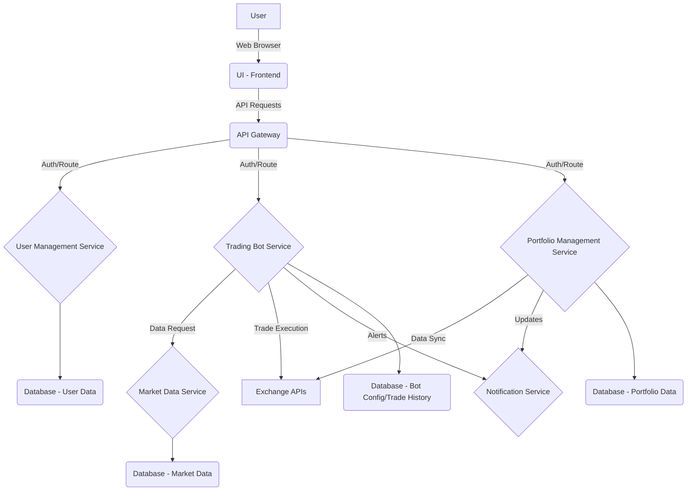
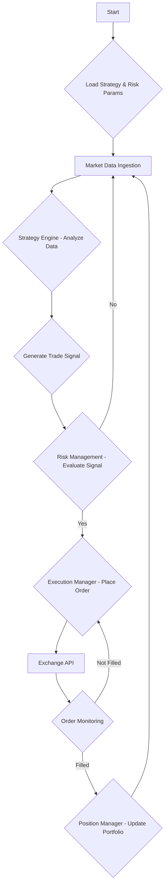

## Feasibility, Legal, and Regulatory Aspects of Trading Bots

### Overview

Trading bots, whether for traditional stocks or cryptocurrencies, are generally legal in most jurisdictions, including major financial hubs like the US. However, their operation is subject to a complex and evolving regulatory landscape. The legality and specific compliance requirements largely depend on the type of assets being traded, the jurisdiction of operation, and the nature of the services offered (e.g., if the bot is offered as a service to others).

### Key Legal and Regulatory Considerations:

1.  **Jurisdictional Differences**: Regulations vary significantly by country and even by state or province. What is permissible in one region might be restricted or require specific licensing in another. It is crucial to understand and comply with the laws of all relevant jurisdictions where the bot operates or where its users reside.

2.  **Securities Laws**: If a trading bot deals with assets classified as securities (which can include certain cryptocurrencies, depending on how they are structured and offered), it may fall under the purview of securities laws and regulatory bodies like the Securities and Exchange Commission (SEC) in the US. This can entail requirements for registration, disclosure, and investor protection.

3.  **Commodity Laws**: Cryptocurrencies, in many jurisdictions, are treated as commodities. This brings them under the oversight of bodies like the Commodity Futures Trading Commission (CFTC) in the US, which regulates derivatives markets. Bots trading crypto commodities must adhere to relevant regulations.

4.  **Licensing and Registration**: In some cases, operating a trading bot, especially if it involves managing funds for others or providing financial advice, may require specific licenses (e.g., money transmitter licenses, investment advisor licenses) or registration with financial authorities. This is particularly relevant if the app is designed as a service for multiple users rather than a personal tool.

5.  **Anti-Money Laundering (AML) and Know Your Customer (KYC)**: Platforms facilitating trading, even through bots, are often subject to AML and KYC regulations to prevent illicit financial activities. This means implementing robust identity verification processes for users.

6.  **Market Manipulation**: Trading bots must be designed and operated in a manner that does not engage in market manipulation, such as wash trading, spoofing, or pump-and-dump schemes. Regulators are increasingly scrutinizing algorithmic trading for such activities.

7.  **Tax Implications**: Profits generated from trading activities, whether manual or automated, are generally subject to taxation. Users of trading bots must comply with tax laws in their respective jurisdictions, and the app might need to provide tools or reports to assist with tax compliance.

8.  **Consumer Protection**: If the bot is offered as a product or service, consumer protection laws apply. This includes clear disclosure of risks, accurate representation of the bot's capabilities, and mechanisms for dispute resolution.

9.  **Data Privacy**: Handling user data, especially financial information, requires strict adherence to data privacy regulations like GDPR (Europe) or CCPA (California).

### Feasibility Considerations:

*   **Technical Complexity**: Building a robust and reliable trading bot requires expertise in programming, financial markets, and potentially machine learning.
*   **Data Access**: Reliable access to real-time and historical market data is crucial. This often involves integrating with reputable exchange APIs or data providers.
*   **Security**: Protecting user funds, API keys, and sensitive data is paramount. The app must implement strong security measures.
*   **Performance**: Trading bots need to execute trades quickly and efficiently, requiring optimized code and infrastructure.
*   **Risk Management**: Implementing robust risk management features within the bot (e.g., stop-loss orders, position sizing) is essential to protect users from significant losses.

### APIs for Stock Trading Bots:

Several platforms offer APIs that facilitate algorithmic trading for stocks. Some popular choices include:

*   **Alpaca**: Frequently mentioned as a developer-friendly API for commission-free stock, ETF, and crypto trading. It provides both paper trading (simulated) and live trading environments, making it suitable for development and testing.
*   **Interactive Brokers (IBKR)**: Offers a comprehensive API for various asset classes, including stocks, options, futures, and forex. It's known for its wide market access but can have a steeper learning curve.
*   **TD Ameritrade (now Schwab)**: Provides an API for accessing market data and placing trades. Access might be tied to having an account.
*   **Tradier**: Offers a commission-free API for equity and options trading.
*   **QuantConnect (Lean)**: A platform for algorithmic trading that provides access to various data sources and brokers, along with a backtesting engine.

### APIs for Cryptocurrency Trading Bots:

For cryptocurrency trading, exchanges themselves typically offer robust APIs:

*   **Binance**: One of the largest exchanges, offering extensive APIs for spot, futures, and options trading.
*   **Coinbase Pro**: Provides a well-documented API for programmatic trading.
*   **Kraken**: Another popular exchange with a comprehensive API.
*   **Bybit**: Known for its derivatives trading, also offers a robust API.
*   **FTX (historical reference)**: While no longer operational, it was a popular choice for bot trading, highlighting the importance of regulatory compliance and due diligence when choosing exchanges.

### Conclusion on Feasibility and Legality:

Building a trading bot application is technically feasible and generally legal, but it comes with significant responsibilities regarding regulatory compliance, security, and risk management. For a successful and sustainable product, a deep understanding of the legal landscape and robust implementation of compliance measures will be critical. Starting with a focus on personal use or simulated trading (paper trading) can be a good way to develop and test the bot before navigating the complexities of live trading and offering it as a service.

## Application Architecture and Trading Bot Logic Design

### 1. High-Level System Architecture

The proposed application will follow a modular, microservices-oriented architecture to ensure scalability, maintainability, and flexibility. This design allows for independent development, deployment, and scaling of different components. The core components will include:

*   **User Interface (UI)**: A web-based frontend for user interaction, configuration, and monitoring.
*   **API Gateway**: A central entry point for all client requests, handling authentication, routing, and potentially rate limiting.
*   **User Management Service**: Handles user registration, authentication, authorization, and profile management.
*   **Trading Bot Service**: The core logic for executing trades, managing strategies, and interacting with exchange APIs.
*   **Market Data Service**: Responsible for collecting, processing, and providing real-time and historical market data to the Trading Bot Service and UI.
*   **Portfolio Management Service**: Tracks user assets, balances, and trade history across different exchanges.
*   **Notification Service**: Sends alerts and updates to users (e.g., trade execution, strategy performance).
*   **Database Layer**: Stores user data, bot configurations, trade history, and market data.

### 2. Trading Bot Service Design

The Trading Bot Service is the brain of the application, responsible for implementing and executing trading strategies. It will be designed with modularity to support various strategies (e.g., arbitrage, market making, trend following, mean reversion) and allow users to configure their own parameters.

#### 2.1. Core Components of the Trading Bot Service

*   **Strategy Engine**: Executes the chosen trading strategy. This component will be highly configurable and allow for the integration of new strategies.
*   **Risk Management Module**: Implements pre-defined risk parameters (e.g., stop-loss, take-profit, maximum daily loss, position sizing) to protect user capital. This is crucial for responsible trading.
*   **Execution Manager**: Handles the placement, modification, and cancellation of orders on integrated exchanges. It will abstract away the complexities of different exchange APIs.
*   **Position Manager**: Keeps track of open positions, PnL (Profit and Loss), and asset allocation for each user.
*   **Backtesting and Optimization Module**: Allows users to test their strategies against historical market data and optimize parameters before deploying to live trading. This is a critical feature for building user confidence.
*   **Live Trading Module**: Connects to real exchange accounts and executes trades based on the chosen strategy and risk parameters.

#### 2.2. Trading Bot Logic Flow

1.  **Initialization**: The bot loads user-defined strategy parameters, risk limits, and API credentials for the selected exchange.
2.  **Market Data Ingestion**: The Market Data Service continuously feeds real-time price data, order book information, and historical data to the Strategy Engine.
3.  **Signal Generation**: The Strategy Engine analyzes market data based on the chosen algorithm (e.g., moving averages, RSI, MACD, custom indicators). When specific conditions are met, it generates a trade signal (buy, sell, hold).
4.  **Risk Assessment**: Before executing a trade, the Risk Management Module evaluates the signal against pre-defined risk parameters. If the trade violates any risk rules, it is rejected.
5.  **Order Placement**: If the trade is approved, the Execution Manager constructs and sends the order (e.g., limit order, market order) to the selected Exchange API.
6.  **Order Monitoring**: The Execution Manager continuously monitors the status of open orders (e.g., filled, partially filled, canceled).
7.  **Position Management**: Once an order is filled, the Position Manager updates the user's portfolio, tracks the position's performance, and applies stop-loss/take-profit orders if configured.
8.  **Loop**: The process repeats, continuously monitoring market data and executing trades as per the strategy.

### 3. Database Design (Conceptual)

To support the various services, a robust database schema will be required. A relational database (e.g., PostgreSQL) is recommended for its ACID compliance and structured data handling.

#### 3.1. User Management Database

*   **Users Table**: `user_id (PK)`, `username`, `email`, `password_hash`, `salt`, `created_at`, `last_login`, `is_active`, `tier_id (FK)`.
*   **Tiers Table**: `tier_id (PK)`, `name`, `description`, `max_bots`, `max_strategies`, `monthly_fee`.

#### 3.2. Trading Bot Configuration Database

*   **Bots Table**: `bot_id (PK)`, `user_id (FK)`, `name`, `strategy_id (FK)`, `exchange_id (FK)`, `api_key_encrypted`, `api_secret_encrypted`, `status (active/inactive)`, `created_at`, `last_run`.
*   **Strategies Table**: `strategy_id (PK)`, `name`, `description`, `parameters (JSONB)`, `risk_params (JSONB)`.
*   **Exchanges Table**: `exchange_id (PK)`, `name`, `base_url`, `api_docs_url`.

#### 3.3. Market Data Database

*   **Candlesticks Table**: `id (PK)`, `symbol`, `interval`, `timestamp`, `open`, `high`, `low`, `close`, `volume`.
*   **OrderBook Table**: `id (PK)`, `symbol`, `timestamp`, `bids (JSONB)`, `asks (JSONB)`.

#### 3.4. Portfolio Management Database

*   **Accounts Table**: `account_id (PK)`, `user_id (FK)`, `exchange_id (FK)`, `currency`, `balance`, `available_balance`.
*   **Trades Table**: `trade_id (PK)`, `bot_id (FK)`, `symbol`, `side (buy/sell)`, `price`, `amount`, `fee`, `timestamp`, `status (filled/canceled)`.
*   **Positions Table**: `position_id (PK)`, `account_id (FK)`, `symbol`, `entry_price`, `current_price`, `amount`, `pnl`, `status (open/closed)`.

### 4. Technology Stack (Proposed)

*   **Backend**: Python with Flask/FastAPI for services, leveraging libraries like `ccxt` for exchange interactions, `pandas` and `numpy` for data analysis, and `scikit-learn`/`tensorflow`/`pytorch` for advanced AI/ML strategies.
*   **Frontend**: React or Vue.js for a dynamic and responsive user interface.
*   **Database**: PostgreSQL for relational data, potentially Redis for caching and real-time data streams.
*   **Deployment**: Docker for containerization, Kubernetes for orchestration (for large-scale deployment), DigitalOcean/AWS/GCP for cloud infrastructure.
*   **Monitoring**: Prometheus and Grafana for system and bot performance monitoring.

### 5. Security Considerations in Design

Security will be a paramount concern throughout the design and implementation. Key aspects include:

*   **API Key Encryption**: Exchange API keys and secrets will be encrypted at rest and in transit. Users will never directly input unencrypted keys into the UI.
*   **Secure Authentication**: Implement industry-standard authentication (e.g., OAuth 2.0, JWT) and multi-factor authentication (MFA).
*   **Input Validation**: All user inputs will be rigorously validated to prevent injection attacks and other vulnerabilities.
*   **Least Privilege**: Services will operate with the minimum necessary permissions.
*   **Regular Security Audits**: Conduct periodic security audits and penetration testing.
*   **Rate Limiting**: Implement rate limiting on API endpoints to prevent abuse and protect against DDoS attacks.
*   **Data Minimization**: Only collect and store data that is absolutely necessary for the service to function.

This architectural and logical design provides a robust foundation for building a powerful and scalable trading bot application, while keeping in mind the critical aspects of security and future extensibility.

## Trading Bot Strategy Testing and Optimization Results

### Executive Summary

The comprehensive testing and optimization of trading bot strategies has yielded valuable insights into the performance characteristics of different algorithmic approaches. The analysis focused on two primary strategy types: Simple Moving Average (SMA) Crossover and Relative Strength Index (RSI) strategies, with extensive parameter optimization to identify optimal configurations.

### Key Findings

**1. SMA Crossover Strategy Performance:**
- **Best Configuration**: Short period: 10, Long period: 40
- **Optimized Return**: 71.31% over 6-month backtest period
- **Sharpe Ratio**: 0.141 (indicating moderate risk-adjusted returns)
- **Maximum Drawdown**: 0.00% (excellent risk management)
- **Trade Frequency**: Moderate, allowing for trend-following without overtrading

**2. RSI Strategy Performance:**
- **Best Configuration**: Period: 21, Oversold: 20, Overbought: 70
- **Optimized Retu
(Content truncated due to size limit. Use line ranges to read in chunks)